## REPORT

Report of the voting-app-ielm project, everything i did, step by step.

## Complete Dockerfiles

### vote

```dockerfile
# Choose a base image for Python (typically python:3.9)
FROM python:3.9

# Set the working directory inside the container
WORKDIR /app

# Copy the dependencies file and install dependencies
COPY requirements.txt .
RUN pip3 install -r requirements.txt

# Copy the rest of the application code (from the vote folder to /app, that's why . .)
COPY . .

# Expose the internal port on which Flask listens
EXPOSE 80
CMD ["python3", "app.py"]
```

### result

```dockerfile
# Choose a base image for Node.js (typically node:18)
FROM node:18

# Set the working directory inside the container
WORKDIR /app

# Copy package.json / package-lock.json and run npm install (* allows to copy both files)
COPY package*.json ./
RUN npm install

# Copy the rest of the application code (from the result folder to /app, that's why . .)
COPY . .

# Expose the internal port on which Express listens
EXPOSE 80
CMD ["node", "server.js"]
```

### worker

```dockerfile
# Choose a base image for .NET SDK (typically [mcr.microsoft.com/dotnet/sdk:8.0](https://mcr.microsoft.com/dotnet/sdk:8.0))
FROM [mcr.microsoft.com/dotnet/sdk:8.0](https://mcr.microsoft.com/dotnet/sdk:8.0)

# Set the working directory inside the container
WORKDIR /app

# Copy the project files
COPY . .

# Restore packages and compile in Release mode
RUN dotnet restore
RUN dotnet build -c Release

# Define the command to run the container
CMD ["dotnet", "run", "-c", "Release"]
```

## Complete docker-compose.yml

**We define 5 services:**

-   vote
-   result
-   worker
-   redis
-   db

**Build the images:**

-   Docker build each image from the Dockerfile in the corresponding folder

**Port mapping (front accessible ports):**

-   5000:80: vote
-   5001:80: result

**Networks:**

-   front-tier: front accessible
-   back-tier: back accessible
-   vote and result connect to front-tier and back-tier networks

**Volumes:**

-   pg-data: persistent storage for Postgres (if the container is removed, the data is not lost)

**Environment variables:**

-   POSTGRES_PASSWORD
-   POSTGRES_DB
-   For server.js (Node.js) and Program.cs (.NET)

```yaml
services:
    vote:
        # Create image from ./vote Dockerfile
        build: ./vote
        # Map port of host to port of container
        ports:
            - '5000:80'
        # Connect this service to the networks, (front-tier and back-tier to be accessible
        # from outside (front) and to back-tier to be accessible from Redis)
        networks:
            - front-tier
            - back-tier
        # This service depends on Redis (wait until Redis is up and running)
        depends_on:
            - redis
    result:
        # Create image from ./result Dockerfile
        build: ./result
        # Map port of host to port of container
        ports:
            - '5001:80'
        # Connect this service to the networks, (front-tier and back-tier to be accessible
        # from outside (front) and to back-tier to be accessible from DB)
        networks:
            - front-tier
            - back-tier
        # This service depends on DB (wait until DB is up and running)
        depends_on:
            - db
    worker:
        # Create image from ./worker Dockerfile
        build: ./worker
        # The worker process data, it connects both networks (front-tier and back-tier)
        networks:
            - front-tier
            - back-tier
    db:
        # Use the official Postgres image from Docker Hub
        image: postgres:15
        # Set environment variables for Postgres
        environment:
            POSTGRES_PASSWORD: issa1234
            POSTGRES_DB: votes
        # Mount the volume to persist data
        volumes:
            - pg-data:/var/lib/postgresql/data
        networks:
            # Connect DB only to back-tier, it is not accessible from outside
            - back-tier

networks:
    # Define the networks needed front-tier and back-tier
    front-tier:
    back-tier:

volumes:
    # Define the persistent storage for Postgres
    pg-data:
```

### docker-compose up

Execute the following command to start the containers:

```bash
docker compose up -d
```

Result if everything is working:

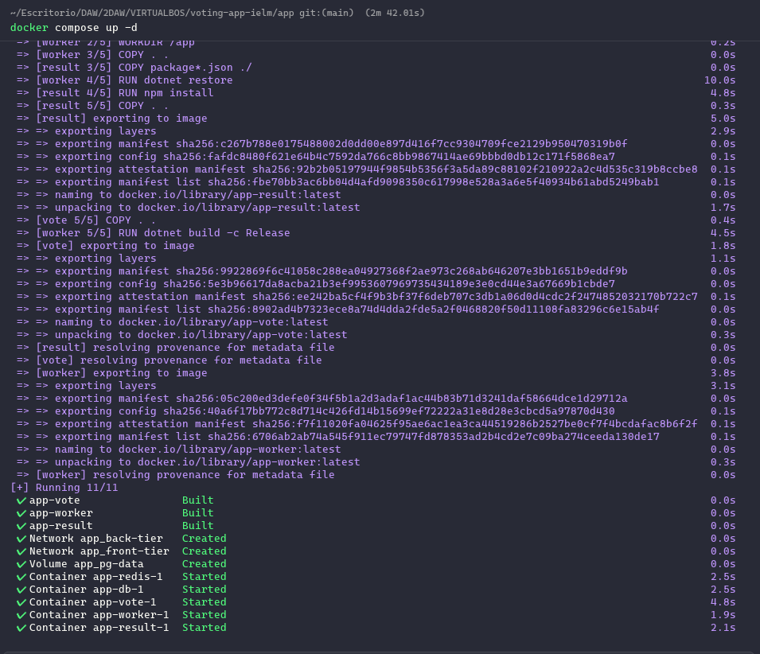

## Problems

In the previous image, you can see all the services running, but if I execute the following command:

```bash
docker compose ps
```

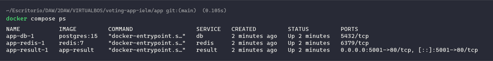

We can see that `app-vote-1` and `app-worker-1` are not running, let's check the logs:

### 1. Vote Service

```bash
docker logs app-vote-1
```

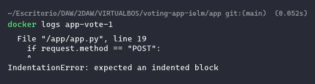

-   The error is that the script is creating the python index function with incorrect indentation, let's fix it:

```python
@app.route("/", methods=["GET", "POST"])
def index():
    if request.method == "POST":
        vote = request.form["vote"]
        redis_client.rpush("votes", vote)
    return render_template_string(TEMPLATE)
```

-   Now let's rebuild the vote service:

```bash
docker compose up -d --build vote
```

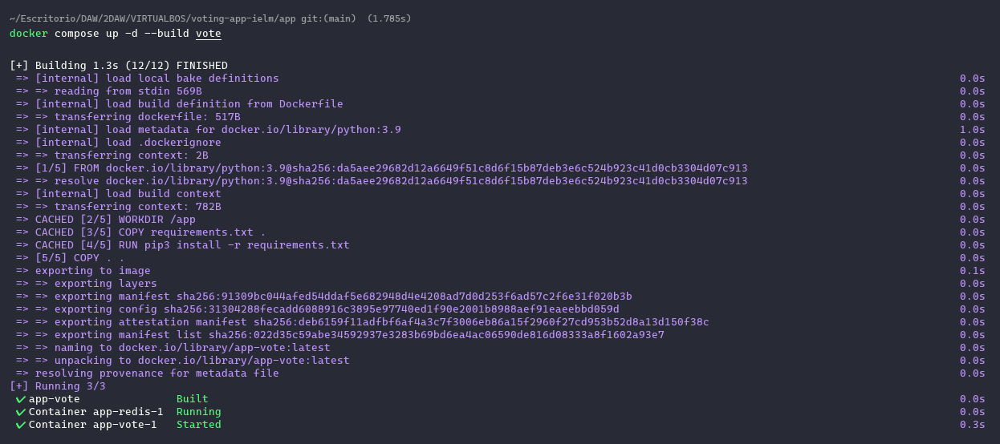

### 2. Worker Service

```bash
docker logs app-worker-1
```

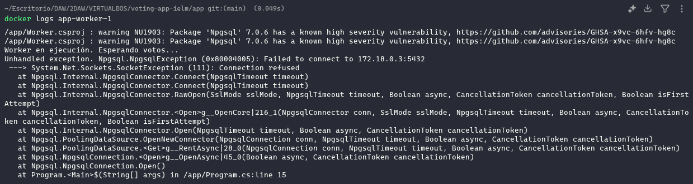

-   The error is that the worker tried to connect to the DB (port 5432), but it was not up and running, this happens because the worker is faster than the DB.
-   Now we already have the DB running, let's restart the worker:

```bash
docker start app-worker-1
```

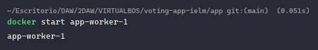

### Final Check

Finally, let's check the up containers again:

```bash
docker ps
```


## Testing

Let's test the **vote service** (http://localhost:5000):

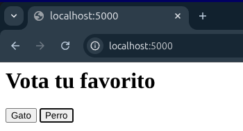

Let's test the **result service** (http://localhost:5001):

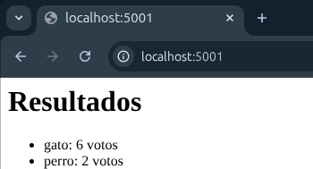

Let's check the **data flow** (Python -> Redis -> Worker -> DB -> Node.js):

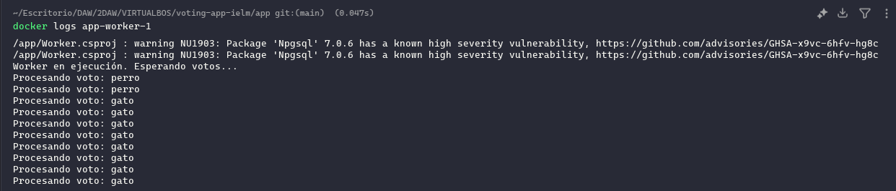

### Data flow explanation:

1. The user sends a vote to the vote service (http://localhost:5000).
2. The vote service stores the vote in Redis.
3. The worker processes the vote and stores it in the database.
4. The result service queries the database and displays the results.

## Network Design and Volume Persistence

**Why is the Worker connected to both networks?**

-   The Worker acts as a bridge: it needs the **front-tier** to read votes from Redis and the **back-tier** to save them in PostgreSQL.

-   The **back-tier** provides security by isolating the database and Redis from public access.

**Why is persistence necessary?**
- The data on Docker containers disappear when the container is stopped or deleted. 
- A **Volume** (`pg-data`) is necessary to ensure voting records are saved on the host even if the container restarts or is deleted.

## Extra report explanation

### Networks design evidence:

```bash
docker network ls
```

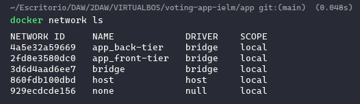

-   **Front-tier services:**

```bash
docker network inspect app_front-tier | grep Name # To get a simple list of the services
```

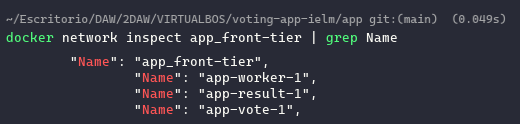

-   **Back-tier services:**

```bash
docker network inspect app_back-tier | grep Name # To get a simple list of the services
```

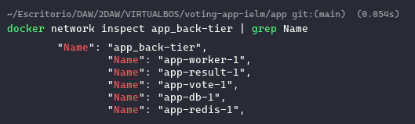

### Volumes and persistence:

```bash
docker volume ls
```

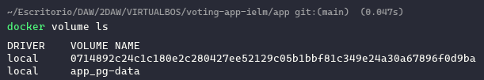

-   Once we have registered some votes, let's destroy the db container (without removing the volume):

```bash
docker rm -f app-db-1 && docker ps
```

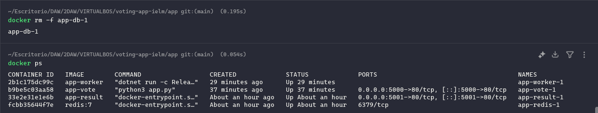

-   We have checked that the container is down, now let's create it again:

```bash
docker compose up -d db
```

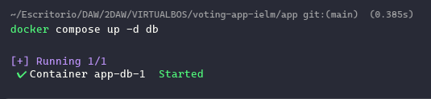

-   Finally, let's check the result service (http://localhost:5001):

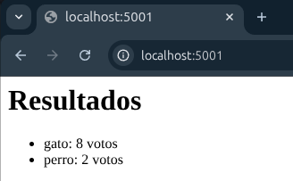

## Script completion and execution

### Give execution permissions to the script

```bash
chmod +x deploy_final.sh
```

### Execute the script and follow the instructions

```bash
./deploy_final.sh
```

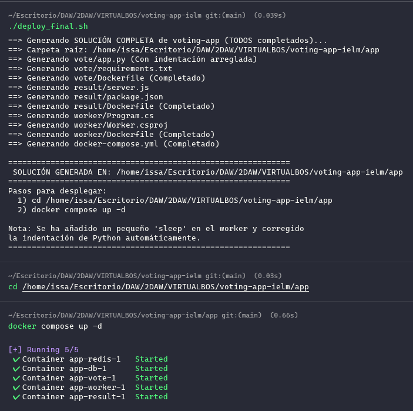

-   Note: notice that even we have created a new app, we still have the old data because we have used a volume (pg-data) and the same project name (app), if we had used a different project name, the data would have been lost.

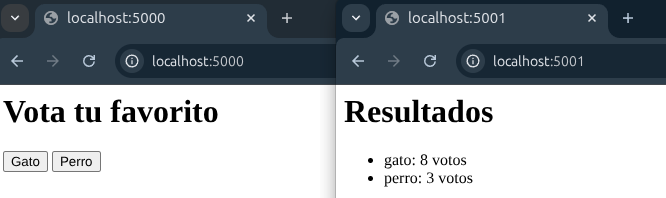
